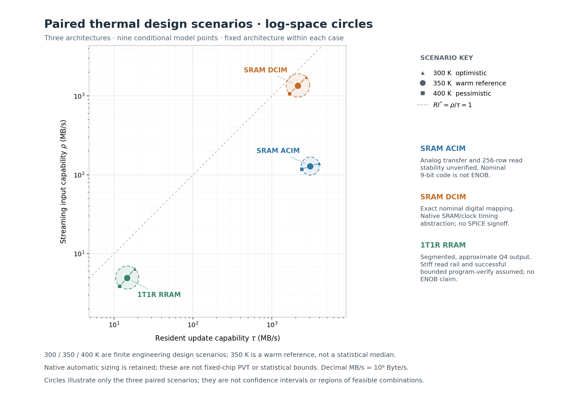

# Step4 V4：参考配置审查与成对热设计情景

九个完整成对估计、必要诊断、表图和独立新构建复核已完成。本轮结论是**带明确模型条件的工程估计成立**，不是三类器件的实测典型值、精度认证或严格上下界。尤其不能将 SRAM 的未验证多行读机制、RRAM 的非零模拟残差，随执行一致性一起升级为“硬件已经验证”。

[九点CSV](results/reference-v4-20261005/summary.csv) · [完整JSON](results/reference-v4-20261005/summary.json) · [输入继承／来源账本](provenance/input_ledger.json) · [独立审查](reports/review.json) · [中文复核](reports/review.zh.md)。

## V3参考值分别如何处理

|案例|审查结论|V4处理及资格|
|---|---|---|
|SRAM ACIM|原大MUX由很小的默认末级驱动；上游家族对末级尺寸／前级负载的处理不一致。|修正驱动链、面积与实际选择线；保留原TG目标。300 K装载值不变，求值值变化。256行读稳定性／转移仍未证明，保留条件性时序架构身份。|
|普通1T1R RRAM|256行理想求和被有限分布线诊断否定；仅用onehot慢RC不能补救幅值错误。|采用16个16×288银行、512 ADC、实际归约／传输、29bit Q4近似输出；完整读写重算。保留generic器件包和写验成功条件，不能推广为所有RRAM。|
|SRAM DCIM|专用组织和26／512周期政策可解释；“2×路径”是保守预算，不是DFF推导出的唯一频率。|保留固定256×256 bit、64棵4bit树及完整sign pass；修正译码负载与热互连响应。300 K主值不变，修正进入中间量但未改变瓶颈／取整。|

本轮还修复了初始化输入被driver覆盖、译码奇数地址位真实扇出、NAND/NOR串联数、RRAM验证状态保持、1bit选择器拓扑、数据端负载、Bus方向及最后实际面积求和等缺口。它们与新驱动尺寸、RRAM银行划分、输入接收政策属于不同类别，不能合称“工具修正”。

## 九个成对结果

共同逻辑任务为256×31 signed INT8，B_S=256 Byte、B_R=7936 Byte；参考列／组不增加payload。SRAM ACIM/DCIM名义输出容器25bit，RRAM是29bit signed Q4近似结果。Q4只表示二进制小数位置，不代表实测精度。请求间不重叠，因此本表单次延迟=Δ_S。

|参考实现|成对情景|Δ_S=单次延迟 μs|T_R μs|rho MB/s|tau MB/s|RI*|U*|
|---|---|---:|---:|---:|---:|---:|---:|
|SRAM ACIM|快／300 K|1.83|2.01|140|3.95e+03|0.0354|1.1|
|SRAM ACIM|参考／350 K|1.99|2.6|129|3.05e+03|0.0422|1.31|
|SRAM ACIM|慢／400 K|2.18|3.32|118|2.39e+03|0.0492|1.53|
|1T1R RRAM（16 banks）|快／300 K|39.8|434|6.44|18.3|0.352|10.9|
|1T1R RRAM（16 banks）|参考／350 K|51.9|544|4.93|14.6|0.338|10.5|
|1T1R RRAM（16 banks）|慢／400 K|66.4|675|3.86|11.8|0.328|10.2|
|SRAM DCIM|快／300 K|0.148|2.91|1.73e+03|2.73e+03|0.635|19.7|
|SRAM DCIM|参考／350 K|0.19|3.74|1.35e+03|2.12e+03|0.635|19.7|
|SRAM DCIM|慢／400 K|0.24|4.73|1.07e+03|1.68e+03|0.635|19.7|

三点先定义为300／350／400 K，再执行完整模型。350 K是明确选择的温热工作参考，**不是经验中位数**；快慢指所选服务时序情景，不表示模拟精度也按相同方向改善。工艺均为22nm/LSTP；Training使用其32nm线模型，DCIM使用其40nm Metal0/1模型。这些标签不能消除分支底层差异。

[成对点图PNG](results/reference-v4-20261005/figures/rho_tau_pairs.png) · [SVG](results/reference-v4-20261005/figures/rho_tau_pairs.svg) · [圆图PNG](results/reference-v4-20261005/figures/rho_tau_circles.png) · [SVG](results/reference-v4-20261005/figures/rho_tau_circles.svg) · [三情景表PNG](results/reference-v4-20261005/figures/scenario_table.png)。



## 为什么只选择这一组范围

唯一主变化族为模型支持的温度及其相容响应：温度进入MOS电阻表、铜线电阻、平台自动尺寸化、真实负载和完整读写路径。模型表域为300–400 K，铜线因子为 `1+0.00451(T−300)`；350/400 K分别为1.2255/1.451。DCIM实际使用Metal0/1，原代码仅给general Rho加温度因子；V4将同一来源规则传播至实际金属消费者，不重复相乘。

Ron/Roff/access目标、电压、脉宽、ADC码宽／数量、bank划分、端口、参考结构、两次完整8bit服务、写验算法及clock政策在三个主情景中固定。缺乏相容材料统计，故不随意做电阻／脉冲±20%，不把最快脉冲、高电阻、小负载和更多并行度拼在一起。10ns器件脉冲及一次写验成功只是generic参考需求；主范围不覆盖材料变异、重试分布或精度不确定性。

重新Initialize会改变器件尺寸和布局：例如RRAM access宽随温度为3.454/4.354/5.452F，读MUX NMOS约14.97/18.86/23.62μm；ACIM TG PMOS及DCIM WL TG也变化。因此这是**固定架构的设计情景**，不是同一颗芯片的PVT。HP/LSTP、Vdd、validated/alpha/beta没有当作快慢开关。原生SAR仍是 `(bits+1)ns×转换次数`，不会因温度或公共时钟自动变成完整PVT ADC模型。

[样本最小／最大](results/reference-v4-20261005/sample_extrema.json)逐指标保留产生它的真实paired_id。没有把rho独立最大与tau独立最大合成不存在的点，也没有以样本极值冒充全域单调或数学边界。

## 输入继承与权威入口

|来源类别|实际使用|没有使用|
|---|---|---|
|原NVM共同方法|逻辑Byte、完整装载、保持生命周期、本地边界及rho/tau定义。|旧T_I/T_A/T_D快慢时隙、旧最终性能及特殊宏完整服务。|
|原NVM相关原始文献|多行读风险、线／驱动非理想、分段与program-verify的机制约束。|把9T1C、WH-2T1R、D6CIM或不同工艺材料的精度、偏置和整周期移植到新例。|
|锁定上游|SRAM器件几何、Technology、RC与模块；MLP DigitalNVM二元参考包；V1.4 driver110设计先例。|把公开示例默认称作实测22nm材料统计。|
|新工程选择|350 K参考、16银行、互连／保持、Q4码域、有限重试及capture政策。|以性能排序倒推参数，或给某个corner免费资源。|
|模型输出|解析后尺寸、RC、面积、模块时间、完整服务和比值。|将旧最终时间／新输出回填为器件输入。|

每例 `base_parameters` 与 `scenarios.json` 合并成唯一包，同时生成request.h和Param构造器输入。C++从该包／已构造对象取得温度、器件与组织；V3中重写8k/24k、300K、丢掉wire温度响应等重复入口已清理。解析文件保存实际初始化值；`consumption.json`核对输入到真实字段，反事实诊断再检查正确的中间模块和完整服务。未声明override和不支持的逻辑／温度范围会拒绝。

所有正式构建只读V4规范包与锁定上游，不读V3结果、pilots或legacy replay。[V3比较脚本](compare_v3.py)是结果产生后的独立步骤，不被运行器导入。独立reviewer另以实际文件打开记录核对这一点。

## MUX、SRAM与时钟审查

V3 ACIM的188.879ns是每输入位八组MUX译码总量。300 K时，每个TG约5.90/7.79μm宽，一条select的N/P gate负载约270/356fF，原末级NMOS却只有44nm。V4采用同22nm公开实现的driver110尺寸，末级N宽9.68μm；同时让前级看见真实32.10fF驱动门容，更新面积，并计实际112.64μm选线。不是只换一个较快的末级数字。55/110/220的局部因果探针还表明过度放大会拖慢前级；110来自公开设计先例，未按最快点挑选。

两族译码器补齐了NAND串联、NOR实际输入数和奇数地址位扇出。9bit staging地址的odd位会直接驱动256个NOR输入；漏掉它会把实际约122fF负载当作不足1fF。V4按较大真实INV负载保留原串行门链，明确作为保守时延包络，不冒称精确STA。

Training与V1.4 SRAM TG目标有四倍差别，包含半活动假设；本轮未擅自认定运算符bug，保留Training较保守的大TG。选择线和前级负载的修正不证明256行普通SRAM读稳定。已有特殊电荷域文献不能替它背书；原始[多行SRAM访问专利](https://patents.google.com/patent/US20230008275A1/en)也讨论读扰及underdrive／单元改造的代价。本轮没有偷偷安装这些未计时电路。

ACIM仅接受一次外部输入，输入寄存跨两pass保持；第二pass由已计选择器产生sign/zero序列，取消V3中语义不明的第二次外部采样。仍保留全部8个sign-pass槽。DCIM生命周期诊断显示，直接删掉七个零槽会让LSB-first ShiftAdd结果仍左移7位；需要另计抽取／旁路及控制，故未发布未经实现的19周期能力点。

DCIM同步DFF返回cycle，Training DFF返回半周期秒；V4保留公共组合路径只占半周期的保守预算，分开保存物理路径与预留时间。350 K DCIM物理bit core约1.558ns，公共校正路径3.653ns决定7.306ns周期；写模拟路径4.091ns，capture与ready仍使每行占两周期。26／512周期不变，所以三个点的 `U*=512/26`、`RI*=512/(26×31)`保持不变。这不是SRAM材料不随温度变化，也不是为圆图固定比值。

## RRAM物理与完整服务

数值包仍来自锁定MLP DigitalNVM：Ron8kΩ、Roff24kΩ、access5kΩ、读0.5V、SET/RESET各1V与10ns、4×8F；1.1V access条件另来自Training。它们没有被说成一套联合实测22nm材料。实测[NeuRRAM](https://www.nature.com/articles/s41586-022-04992-8)采用不同工艺、选通与写验条件，不能把其材料统计或完整服务贴过来。本轮文献只用于机制／适用范围判断。

V3列线约522Ω，而256个13kΩ支路并联约50.8Ω。有限分布线模型进一步显示：即使理想端口且不计MUX，密集LRS−HRS参考只相当于49.44个count，而不是256；最远支路约0.040V。V4不是降低timing activity来掩盖这个问题，而是真正切成16个16行银行，每bank仍32 ADC，并保留原大MUX导通目标12.695Ω。

实际16行线阻为32.64/40.00/47.36Ω。将实际MUX串联电阻纳入有限线性诊断后，dense增益为0.958/0.953/0.949，最大部分count误差约0.678/0.749/0.819（16项满量程），最小支路电压约0.482/0.480/0.478V。这仍假设稳定低阻read rail；将较大的源阻串入会明显失效。该要求是边界条件，不是LevelShifter已经证明整套供电。 密集并读的理想电流需求量级可达 `16 banks×32列×16行×0.5V/13kΩ≈315mA`；平台没有验证供电／地线阻抗和瞬态压降。真实实现若不能维持这个低阻边界，该点无效，而不是改ADC增益掩盖。

名义固定ADC增益由实际电导重导为16codes/count；onehot码13/29，最高理想原始码464<1024。差分后保留Q4，经本地ShiftAdd、每pass512个24bit传输字、12288bit staging、32棵四级AdderTree及29bit signed校正。未用免费端点拟合消除物理残差。V3理想half-up等式 `Q(a+2m)−Q(a)=2m` 本来成立；本轮没有将它误报为代数bug。改变参数后硬写2/4才是不通用的入口，分布电阻才是原物理资格的关键缺口。

**Q4不是精度保证。** 实际有限向量诊断中，满幅输出偏差约4.30/4.69/5.08%；真值为零的signed cancellation向量残差为16891/762/889。mixed向量的最大绝对残差为6745/4039/6816，部分小真值的相对误差达11.6/4.78/2.80倍，且不随温度单调。故这些点只用于接受该粗略近似服务及其条件的分析；不能自动适配精确INT8点积或弱信号敏感工作量。名义算术通过、格式位宽和模拟精度分开记录在 [numeric](results/reference-v4-20261005/numeric.json) 与 [qualification](results/reference-v4-20261005/qualification.json)。

银行化的外围代价全部保留：读有16条单向32bit point links和hub MUX，写有16条独立同源32bit分发分支；事务互斥，共享外部32bit口。每bit的512个staging D-pin、各bank九组写D-pin及root扇出有实际负载／驱动。每轮布局重新计算所有native面积与线长，最终采用固定近方形规则容纳；三设计点约4.79/5.18/5.59mm²，不能藏在小bank外框里。该保守参考组织明显不同于ACIM/DCIM，不能作等面积或材料本征排名。

完整装载从任意旧二元状态出发，每行RESET＋verify、目标masked SET＋verify；32bit公共口共2304个物理beat。一次尝试需求为4608个编程槽、4608个ADC验证轮次；参考位和未使能SET槽仍占资源。预期码由真实目标行缓冲派生；双向Comparator、sticky mismatch、归约、clear及上限为两次的控制均计入。主点条件为第一次通过；第二次需求另做诊断，不伪造概率或平均次数。达到上限仍失败则不发布compute-ready，不给正吞吐点。

V4取消无期限held-read idle：每次银行unsigned服务后、长时间gather前，并行执行原生WL全零更新；resident每bank完成后顺序执行归零。无任意guard，仍用同一选通／LevelShifter时间。数据寄存、bank结果和A/C在后续B/D服务期间保持，不能覆盖未消费数据。源供电、器件脉冲成功、模拟误差及原生控制／DFF抽象仍是明示条件，不是未申明的硅验证。

## 时间构成、历史变化与指导结论

350 K ACIM约64%的stream时间来自固定SAR转换，MUX译码约21%；其写时间主要是512次WL更新及256次入口捕获。RRAM每pass约22.65μs用于汇聚，银行unsigned约3.22μs；完整resident中verify约287.1μs、器件脉冲46.08μs，另外必须计控制建立／释放、数据捕获和传输。器件脉宽10→20ns只增加46.08μs，不使完整装载翻倍。

[V3→V4比较](results/reference-v4-20261005/comparison_v3.csv)首先在300 K比较，再单列350 K温热输入变化：

|案例|V3 Δ/T_R μs|V4修订、300 K μs|V4温热reference μs|
|---|---:|---:|---:|
|SRAM ACIM|4.55 / 2.01|1.83 / 2.01|1.99 / 2.60|
|1T1R RRAM|10.8 / 471|39.8 / 434|51.9 / 544|
|SRAM DCIM|0.148 / 2.91|0.148 / 2.91|0.190 / 3.74|

模型、架构、负载及政策的相互影响只在“同温度全部参考修订”中算一次，不把若干单独增益重复相加。RRAM变化尤其不是同一颗宏的工具校正；其容量分组、ADC、互连、状态保持及输出契约均已改变。

在这个有限样本域中，DCIM的rho最高，ACIM的tau最高，RRAM两侧都受到所选银行／互连组织的明显限制；不推出材料普遍排序。ACIM U*约1.10–1.53；RRAM约10.2–10.9；DCIM固定19.7。V3中RRAM与DCIM的U*先后关系在参考架构修订后反转，不能据旧比值给稳定的技术结论。较低U*也不自动表示更优：很慢的stream本身会降低装载—求值平衡阈值。

## 圆图、复现与停止

横tau、纵rho均为十进制MB/s，等log长度；reference大点，快慢小点，同case相连。圆按端点中垂线投影规则构造，三个reference均实际在圆内，半径约0.115/0.149/0.147个数量级；本次未触发fallback。脚本仍明确处理外部reference或退化端点，绝不移动性能数据。圈只概括三对点，不是置信区间，也不意味着圈内组合都可实现。程序几何／SVG坐标检查与三PNG实际查看分别保存。

主运行在 `/Users/shine/neurosim/runs/step4-v4/reference-v4-20261005`。三个案例agent、绘图agent和未参与V4生产的新reviewer均实际启动；reviewer从仅V4文件包独立构建九点及诊断，核对输入消费、阶段总量、面积、物理向量、实际SVG和无旧结果依赖。复跑匹配不代替上述适用性判断。最终[独立结论](reports/review.zh.md)不代表用户或外部ChatGPT验收。

```sh
# 仓库根；每次换新的run-id，拒绝覆盖已有运行目录。
python3 -B tasks/task1_table_I_NeuroSim/step4_v4/run.py \
  --run-id my-v4-run --diagnostics --plots --no-export
# 单例或单参考点；完整九点图需要all cases与all scenarios。
python3 -B tasks/task1_table_I_NeuroSim/step4_v4/run.py \
  --case ns_rram_1t1r --scenario reference --run-id my-v4-rram --no-export
```

也可将本包复制到OneDrive外的新目录，用绝对路径执行。环境根为NEUROSIM_ROOT或`$HOME/neurosim`，可传`--root`；编译器NEUROSIM_CXX／`--cxx`，绘图解释器NEUROSIM_PLOT_PYTHON／`--plot-python`。本机使用g++16和已有Anaconda matplotlib。只有`--export`按白名单导出小型结果；全源码副本、二进制、完整日志、旧候选与失败现场均留本地。

本轮只新增V4与最小根导航；V3/V2/pilots/NVM/Table II/论文/旧结果及锁定上游未回写。没有git add、commit或push。停止Step4 V4，等待用户及外部审阅，不自动扩展器件、设计搜索、workload或论文。
