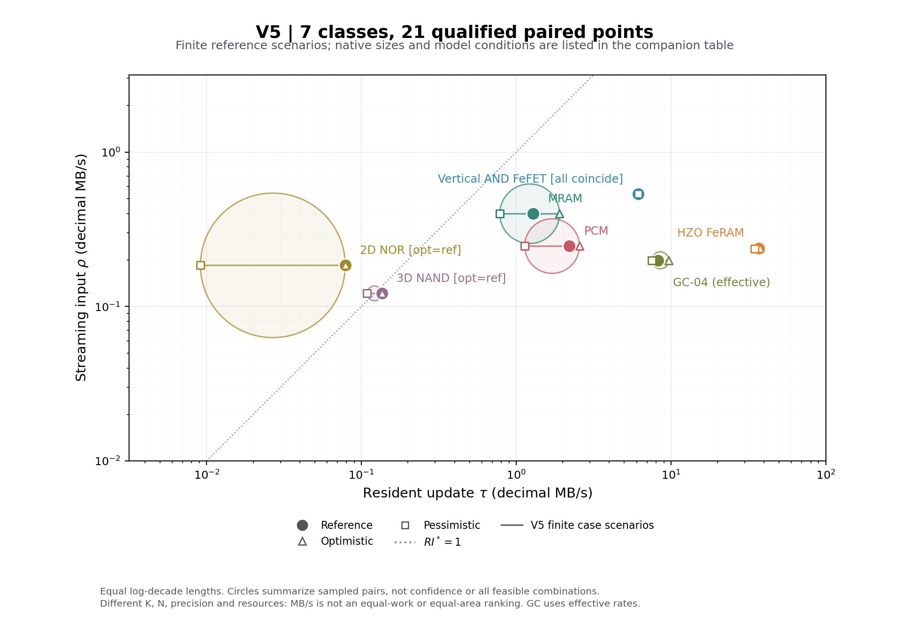

# Step4 V5：七例参考、有限成对范围与最终交付

七例21个配置已全部实际构建、运行，并与独立新源码、新构建的21点逐项绑定，最终表图独立复核通过。只读纳入V4九点后得到10类30点总览。**这是带明确模型条件的参考服务，不是硅签核、统计置信区间或等精度/等面积排名。** GC-04仍是需要刷新的易失性硅gain-cell。

[21点CSV](results/final-reviewed-20261005/points.csv) · [完整JSON](results/final-reviewed-20261005/points.json) · [30点CSV](results/final-reviewed-20261005/combined_points.csv) · [旧NVM独立背景表](results/final-reviewed-20261005/legacy_background.csv) · [最终运行清单](provenance/final_run_manifest.json) · [21点独立绑定](results/final_review_bindings.json) · [独立总览复核](reviews/p5_overview/review.json)。

## 参考值与范围

以下表格从最终机器结果生成。ρ、τ为十进制MB/s，Δ和T为计算服务率所用间隔；除GC外，它们分别等于单次求值及完整装载时间。U*是装载—求值平衡阈值，不是workload实际复用次数。

|Case|K x N|Delta effective (us)|T_R effective (us)|rho MB/s|tau MB/s|RI*|U*|
|---|---|---:|---:|---:|---:|---:|---:|
|PCM|128 x 16|519.8219|932.7419|0.2462382|2.195677|0.1121468|1.794349|
|MRAM|64 x 64|160.6|3174.6|0.3985056|1.290241|0.3088613|19.76712|
|2D NOR|256 x 16|1386|52077.66|0.1847042|0.07865177|2.348379|37.57407|
|Vertical AND FeFET|128 x 16|238.8|333.2|0.5360134|6.146459|0.08720687|1.39531|
|HZO FeRAM|32 x 16|134.0969|13.84|0.2386334|36.99422|0.00645056|0.103209|
|GC-04 effective|64 x 16|321.4|124.2889|0.1991288|8.23887|0.02416943|0.3867109|
|3D NAND|4608 x 240|37873.5|8160085|0.1216682|0.135528|0.8977347|215.4563|

GC reference的物理单次求值为116.4µs，raw完整装载/刷新后首个装载为51.4µs；长期有效间隔为321.4µs和124.289µs。raw能力约0.5498/19.922 MB/s，主图使用长期有效0.199129/8.23887 MB/s。刷新payload为0，已核算逐组写回、不可抢占guard与跨刷新进度，没有用raw/availability冒充单次延迟。

|Case|rho range (MB/s)|tau range (MB/s)|
|---|---:|---:|
|PCM|0.2462382|1.135795 - 2.561211|
|MRAM|0.3985056|0.7842837 - 1.904585|
|2D NOR|0.1847042|0.009129048 - 0.07865177|
|Vertical AND FeFET|0.5360134|6.146459|
|HZO FeRAM|0.2369372 - 0.2389756|34.59459 - 37.51465|
|GC-04 effective|0.1991288|7.526912 - 9.699635|
|3D NAND|0.1216682|0.1088152 - 0.135528|

这是三个完整成对情景的样本范围；各指标极值和对应配置ID见[样本极值](results/final-reviewed-20261005/sample_extrema.json)，不将独立最快read/write拼成不存在的点。NOR及NAND的optimistic/reference真实重合；FeNOR三点完全重合，图中只留重合点，不造非零圆。

## 身份、原语与主要资源

|案例|实际路径与资源|范围及关键限制|
|---|---|---|
|[PCM](cases/pcm/REPORT.zh.md)|TiSbTe常规1T1R二元感测＋独立额定HV端口；16384bit、128 SA/reference、16编程源、8算术lane。|RESET/SET完整波形20/100、50/200、100/1000ns；热写不由低压读R外推。不是旧电压求和宏，旧未闭合LV候选保留在lv_readonly。|
|[MRAM](cases/mram/REPORT.zh.md)|UMEM同源1T1MTJ确定性模型；8 banks、32768 MTJ、256 SA/reference、32全域写lane和32数字lane。|0.6V两方向plateau为0.5/1/2µs，有限成功服务；不是旧2T2MTJ/IBMD、实测典型或随机写错误率预测。|
|[2D NOR](cases/nor2d/REPORT.zh.md)|ESF1阈值读端口接130nm外围；32768bit、64 SA/reference、显式4pF分支、8 MAC；完整4KiB sector/16页/SPI。|gate1.3/1.2/1.1V与商品P/E typ/max条件包。内部pulse/verify/recovery不重复计，商品规格转用不是新阵列保证。|
|[垂直AND FeFET](cases/fenor3d/REPORT.zh.md)|四层容量、32横向通路、共享BL/SL及层选；2048 data SA/参考支路、16数字lane、128真实program lane。|阈值窗口±0.05V有限包；固定controller使三率相同。层数未乘吞吐，32操作数未免费变成32 MAC。|
|[HZO FeRAM](cases/feram/REPORT.zh.md)|4096个1µm²极化电容，32行使实际BL约250.138fF；128 SA/保持、128恢复与128外部写lane，额定HV访问/PL/BL。|14/20/50ns为完整写政策，不拆成每极性脉宽。100ns读观察域、极化电荷及全128bit破坏域恢复保留；不是nvCap/eDRAM。|
|[GC-04](cases/gc04/REPORT.zh.md)|16384易失cell、16子阵列、256单端11bit SAR、128差分/反馈pair、16 MAC及16bit Xsum，显式采样/积分/hold C。|固定353K、反馈65/75ns与400/350/330µs维护期限。N64失败后采用明确N16新设计；不是保持分布或全温度保证。|
|[3D NAND](cases/nand3d/P4_MODEL.zh.md)|32层series EKV延伸；84934656 cell、64 SL/SAR、128外部TIA/buffer、16算术lane；6144页/64 erase及参考校准。|16层实测DC不冒称32层实测；hybrid AMP静态typ10.56W、悲观14.72W。nominal约2.9%、极端pass约+44%/−22%及孤立量化0保留，不称精确INT8。500ns controller、校准及Byte装载主导，不是材料极限。|

NAND接收器依据[LTC6268官方数据表](https://www.analog.com/media/en/technical-documentation/data-sheets/62689f.pdf)，有限A0/GBW/Cin/slew/offset进入模型，P/E保持独立的条件跨实现完整服务。各例`inputs.json`把原生电路、最小适配、外部原语和服务政策分开；解析后硬件、RC、阶段和资格在[snapshots](results/final-reviewed-20261005/snapshots)。

这些结果用于解释主导机制、资源和服务政策，不能推出通用材料排序。名义精确数字算术、模拟Q格式与实测精度不同；NAND/GC不能因容器为32bit就与数字案例等精度。读写共享资源按互斥服务计，不承诺两峰值同时达到。

## 正式图与历史关系

[七例圆图PNG](results/final-reviewed-20261005/figures/v5/v5_rho_tau_circles.png) · [SVG](results/final-reviewed-20261005/figures/v5/v5_rho_tau_circles.svg) · [成对点图](results/final-reviewed-20261005/figures/v5/v5_rho_tau_pairs.png)。



[10类圆图PNG](results/final-reviewed-20261005/figures/ten/ten_rho_tau_circles.png) · [SVG](results/final-reviewed-20261005/figures/ten/ten_rho_tau_circles.svg) · [成对点图](results/final-reviewed-20261005/figures/ten/ten_rho_tau_pairs.png)。

横tau、纵rho，等log长度，大reference与小两端按同硬件连接。圆沿用端点中垂线投影并处理退化/参考外圈；仅概括有限样本，不是置信区域或全部组合可实现。只移动标签，数据坐标不动；几何与输出哈希见各图目录`geometry.json`。

V4的300/350/400K是固定架构重新尺寸化的热设计情景，350K不是统计中位数或同芯片PVT；其SRAM ACIM多行条件和RRAM Q4残差保留。V5为逐例器件/协议有限包，两组语义分层。旧NVM推荐十例另表，不把架构、规模、精度或后端改变统一称作“工具修正”。NVM→V2→V3/V4→V5证据关系保留，新计算不走旧replay。

## 复核、运行与计算包

最终21配置直接从不含旧结果、candidate/reference_snapshot、报告或legacy的compute-only包运行。首批18成功；MRAM三点在编译前发现规范INTERFACE/PROBE_API打包遗漏。补齐两份规范后只补跑MRAM，其他18不重复；模型及计算哈希未变，失败现场保留。所有最终计算文件均与最终包和管理规范源一致。

独立审核均有真实新源码、新构建、新目录。在计算文件/输入hash与final run相同时复用已完成的独立fresh，不沿用修复前PASS。[绑定记录](results/final_review_bindings.json)列出21个独立run。[最终表图独立复核](reviews/p5_overview/review.json)覆盖V4只读、GC口径、单位、SVG等log尺度、退化圆和四张实际PNG。复现一致不等于硅签核。

最终包：`/Users/shine/neurosim/runs/step4-v5/packages/final-compute-seven-r2-20261005`，82文件、928081B。完整运行集合：`/Users/shine/neurosim/runs/step4-v5/integration/final-seven-complete-20261005`。完整trace、源码副本和二进制均在非同步区。

```sh
# 任意cwd；每次使用新的run-id。
python3 -B /Users/shine/neurosim/runs/step4-v5/packages/final-compute-seven-r2-20261005/v5.py \
  run --case nand3d --scenario reference --run-id my-v5-nand
python3 -B /Users/shine/neurosim/runs/step4-v5/packages/final-compute-seven-r2-20261005/v5.py \
  all --run-id my-v5-seven --workers 2
```

[RUNNING](RUNNING.zh.md)提供诊断、导出及独立compare/plots命令；使用已有matplotlib，未安装/升级依赖。正式白名单输出约2.41MB，路径、大小和哈希见[export manifest](results/final-reviewed-20261005/export_manifest.json)。

## 保护与停止

只新增V5及任务README/STATUS导航；旧阶段、pilots、NVM、Table II、论文及锁定原上游不变。root和后来观察到的tasks两处`.DS_Store`均保留、不纳交付。无git add/commit/push或破坏性清理。白名单无源码树、二进制、完整日志、缓存或symlink，见[保护审计](provenance/preservation.final.json)。

七例无未关闭的主导机制/资源阻断，但来源、精度、HV、保持和跨实现条件继续有效。停止于Step4 V5，交用户及外部ChatGPT审阅，不扩展workload、DNN训练、新器件或论文。建议提交名：`task1_neurosim_step4_v5_seven_devices`；是否提交由用户决定。
