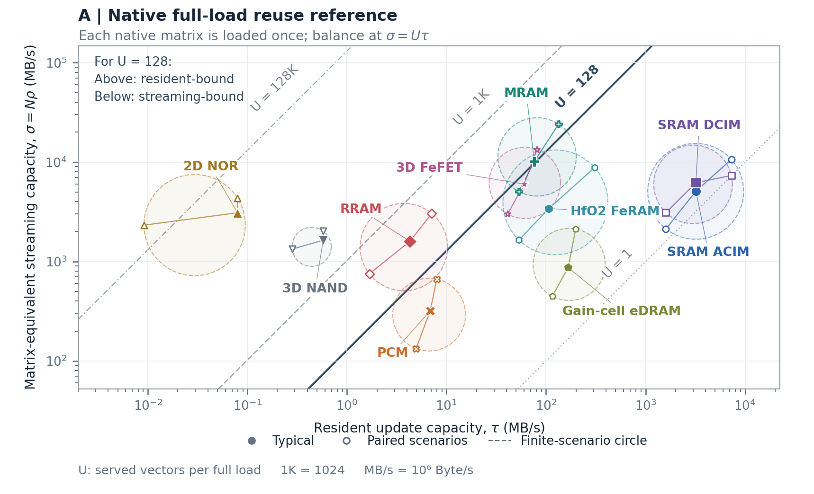
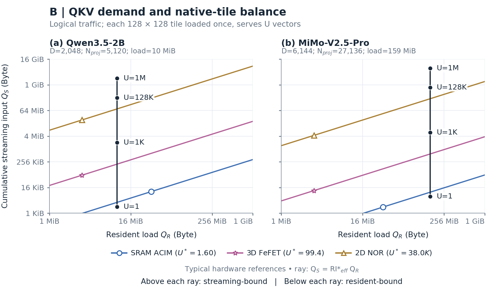
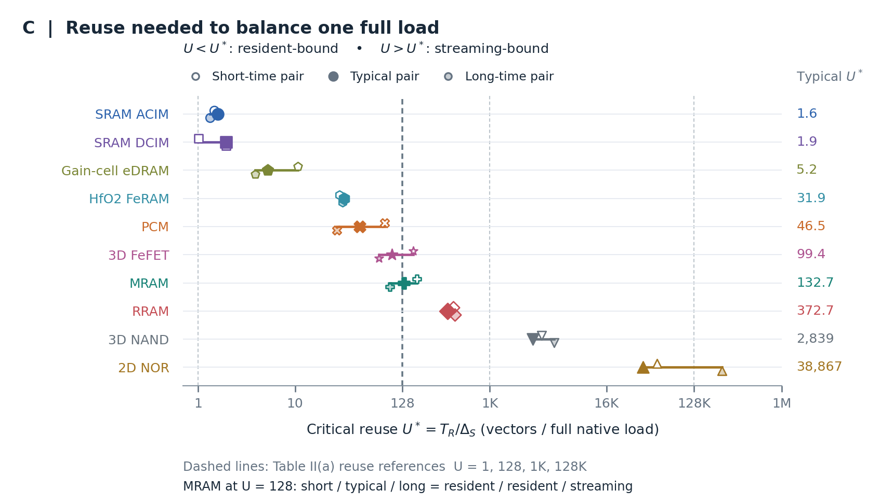
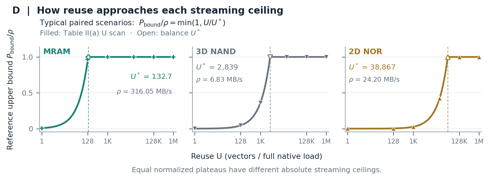
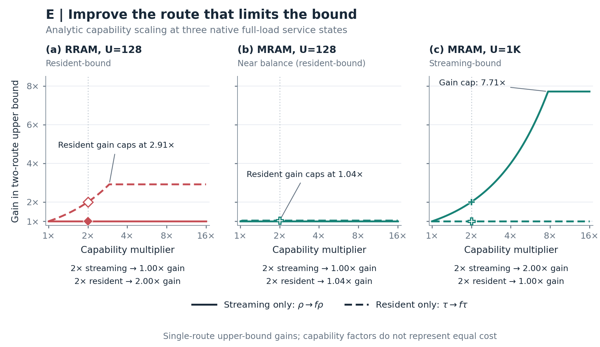

# Task III 候选图集

五张候选分别回答能力位置、绝对需求、临界复用、上界饱和与改进方向。请先看[缩略总览](overview.png)，再按下面顺序逐张比较；[合并 PDF](candidates.pdf) 每张一页、保留矢量。[选图建议](SELECTION.zh.md)给出两种侧重点的组合。

所有图按 **7.16 in 跨双栏**制作，不能直接缩成单栏。输入沿用已验收的 Task I/II；[共同方法](../shared/README.zh.md)集中说明计量边界与转换。A/C/D/E 比较各自完整原生矩阵的复用要求；B 额外完成两个真实 QKV 阶段与同形 128×128 原生服务的明确分块对应。最终由用户选择至多两张。

## A：硬件能力平面＋复用需求参照

**读法：** 横轴是 resident 更新能力 τ，纵轴是显式变换后的 σ=Nρ。每条斜线表示一种复用要求，线以上为 resident-bound、以下为 streaming-bound；粗线突出 U=128。十类硬件保留三条真实成对情景，圆仅作有限情景的视觉摘要。

**看点：** 在同一幅图里保留能力大小与两路比例；MRAM 等靠近平衡线的对象需逐情景判断。四条 U 来自 GEMM W[128,128] 的已验收状态，跨不同原生形状时仅迁移复用要求。

**取舍：** 最接近 Task I 原图，适合作为保底；σ 并非原始输入吞吐，读者需要先理解一次坐标转换。

[中文说明](../01_hardware_overlay/README.md) · [英文 caption](../01_hardware_overlay/caption.en.md) · [矢量 SVG](../01_hardware_overlay/figure.svg)

## B：QKV 绝对需求与同边界硬件参照

**读法：** 两个面板使用相同的逻辑 Byte 坐标。黑点是两模型的四个真实 U 状态；每个模型的彩色平衡射线均经其自己的输入重放因子换算。点在射线上方为 streaming-bound、下方为 resident-bound，方向与 A 相反。

**看点：** MiMo 的 resident 字节是 Qwen 的 15.9 倍，同 U 输入字节是 3 倍；在所声明的完整 tile 服务参考下，平衡 U* 仍相同。绝对需求差异与复用比例差异不能混为一谈。

**取舍：** 这是候选中与具体模型连接最直接的一张；需要介绍顺序 tile 组件服务映射，范围限于两个 QKV 阶段与三个典型同形硬件，不代表整模型部署吞吐。

[中文说明](../02_demand_dual/README.md) · [英文 caption](../02_demand_dual/caption.en.md) · [矢量 SVG](../02_demand_dual/output/figure.svg)

## C：一次装载需要多少次复用？

**读法：** 横轴 U*=T_R/Δ_S，把比值翻译为“每次完整装载对应多少次向量服务”。每行的三个点是真实情景，右侧列出典型阈值；中性竖线对应四个已选 U。

**看点：** U=128 时，MRAM 的 short/typical/long 三点分别为 resident/resident/streaming。NOR 典型值约 38,867，但 long 情景仍在 128K 右侧，不能只凭典型点推广整个情景组。

**取舍：** 读法最直接，能替代 A 成为主分析图；不保留两路绝对能力，需与 Task I 表或另一幅图一起读。按阈值排序不等于性能排名。

[中文说明](../03_reuse_threshold/README.md) · [英文 caption](../03_reuse_threshold/caption.en.md) · [矢量 SVG](../03_reuse_threshold/output/figure.svg)

## D：复用增长何时达到上界平台？

**读法：** 三个面板画各自的 min(1,U/U*)。实心点为原 Task II(a) 有限扫描，空心点为推导的平衡点。平台都是 1，但各面板标出的原生 ρ 不同。

**看点：** MRAM 在 U=128 时达到自身参考 streaming 上界的 96.43%，仍未跨界；NAND 与 NOR 要求更高复用。超过 U* 后，继续增加 U 不再提高该两路上界。

**取舍：** 曲线解释很直观、版面较矮；与 C 共享同一阈值信息，若两张都选，新增信息主要是上界接近程度。它不是实测利用率。

[中文说明](../04_normalized_response/README.md) · [英文 caption](../04_normalized_response/caption.en.md) · [矢量 SVG](../04_normalized_response/output/figure.svg)

## E：改善哪条通路才有收益？

**读法：** 对 RRAM U=128、MRAM U=128、MRAM U=1K 三个典型原生工况，分别只提高 ρ 或只提高 τ；纵轴是相对原始两路参考上界的增益。介质颜色不变，线型区分被改善的通路。

**看点：** 同一 MRAM 随 U 改变，值得提高的通路也会改变；接近平衡时，只改善一路的增益很快受另一路限制。能力倍增不等于上界倍增。

**取舍：** 设计启示最直接；倍率属于解析干预，不是新硬件测量，也没有面积、功耗或相同成本的含义。

[中文说明](../05_improvement_payoff/README.md) · [英文 caption](../05_improvement_payoff/caption.en.md) · [矢量 SVG](../05_improvement_payoff/output/figure.svg)

## 审阅入口

- [共同来源与接口](../shared/README.zh.md)
- [Supervisor 审查与修改记录](REVIEW.zh.md)
- [独立复核：共享接口与 A/C/D](independent_ACD.zh.md)
- [独立复核：B/E](independent_BE.zh.md)
- [两图组合建议](SELECTION.zh.md)

用户可按“图号＋需要保留或修改的内容”给出意见；此图集不预先锁定最终论文用图。
